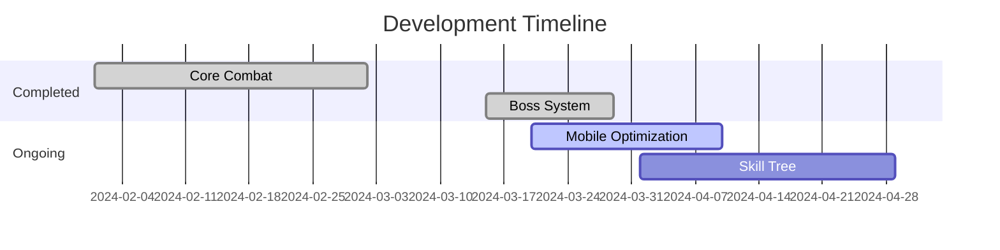

# Incremental Rogue-like


## About the Game
Mobile-friendly incremental/clicker with:
- Endless tiered boss waves
- Dynamic enemy compositions
- Cluster spawning mechanics
- Progressive stat scaling

**Core Loop:** Fight → Survive → Upgrade → Repeat

## Key Features
### Combat System
- **Boss Types**
  - *Standard*: Teleport + Enrage
  - *Swarmlord*: Minion Summoner
  - *Phasebeast*: Damage Trails
- **Progression**
  - 5 Upgrade paths with compound scaling
  - Permanent stat persistence
  - Risk/reward wave bonuses

### Recent Additions
```diff
+ [v0.3] Tiered Boss System
+ [v0.3] Elite Enemies
+ [v0.3] Cluster Spawning
```

## Project Structure
```bash
.
├── main.lua            # Core loop
├── enemy.lua           # Boss/elite logic
├── waves.lua           # Wave progression
├── effects.lua         # Damage/ability FX
└── upgrades.lua        # Upgrade economy
```

## Development Progress
```progress
|-- Core Mechanics [95%]
|-- Content [80%]
|-- Polish [60%]
```

## Roadmap


## Known Issues
```yaml
- #55: Minion spawn overlap
- #49: High-tier boss verification
- #44: Mobile performance
```

## Installation
```bash
git clone https://github.com/yourusername/incremental-roguelike.git
love .
```

---

*Maintained using [Keep a Changelog](https://keepachangelog.com/)*
