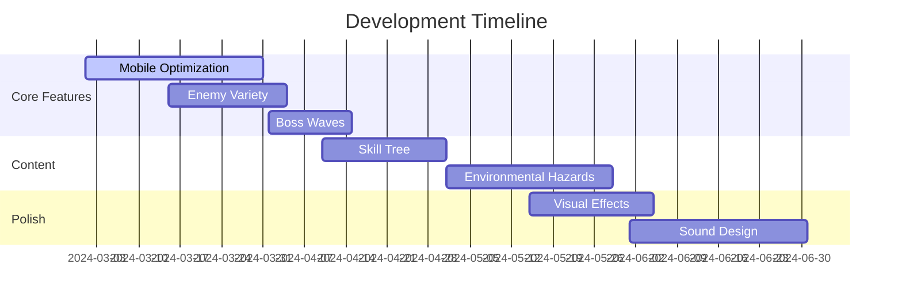

# Incremental Rogue-like

 *Add a screenshot later*

## About the Game
A mobile-friendly incremental/clicker game with rogue-like elements where players:
- Survive endless waves of enemies
- Collect gold from defeated foes
- Upgrade character stats in a shop between waves
- Manage progressive difficulty scaling
- Balance offensive/defensive capabilities

**Core Gameplay Loop:**  
Fight → Earn Gold → Upgrade → Survive Longer → Repeat

## Design Goals & Objectives
### Key Principles
1. **Accessible Depth:** Simple controls with gradually revealed strategic depth
2. **Progressive Challenge:** Infinite scaling with balanced difficulty curves
3. **Mobile First:** Touch-friendly UI and short play sessions
4. **Visible Growth:** Clear feedback on character progression
5. **Addictive Loop:** Constant "one more wave" motivation

### Current Objectives
```progress
|-- Core Mechanics [90%]
|   |-- Wave System [100%]
|   |-- Shop System [100%]
|   |-- Combat System [80%]
|   `-- Progression [90%]
|
|-- Content [65%]
|   |-- Enemy Types [40%]
|   |-- Upgrades [80%]
|   `-- Visuals [50%]
|
`-- Polish [30%]
    |-- Balance [40%]
    |-- Mobile Optimization [20%]
    `-- Juice/Feedback [10%]
```

## Project Structure
```bash
.
├── main.lua            # Core game loop and Love2D callbacks
├── conf.lua            # Love2D configuration
├── player.lua          # Player stats/mechanics
├── enemy.lua           # Enemy behaviors/spawning
├── waves.lua           # Wave progression system
├── shop.lua            # Upgrade shop interface
├── upgrades.lua        # Upgrade definitions/economy
├── projectile.lua      # Attack projectiles system
├── utils.lua           # Helper functions/utilities
└── README.md           # This document
```

## Key Features Implemented
### Core Systems
- **Wave Progression**
  - Defined wave configurations
  - Infinite scaling post-wave 5
  - Automatic shop access between waves
- **Character Development**
  - 5 Upgrade paths: Damage, Speed, Crit, Defense, Regen
  - Compound interest-style cost scaling
  - Permanent progression through levels
- **Combat Mechanics**
  - Auto-targeting nearest enemy
  - Defense damage mitigation
  - Passive health regeneration
- **Economy**
  - Gold drops from enemies (50-500 per kill)
  - Progressive upgrade costs
  - Risk/reward wave completion bonuses

### Recent Additions
```diff
+ [v0.3] Defense & Regeneration systems
+ [v0.2] Infinite wave scaling
+ [v0.1] Core combat loop
```

## Development Progress
### Completed
- Basic enemy spawning/waves
- Shop interface with 5 upgrades
- Gold economy system
- Mobile touch input handling
- Wave-based difficulty scaling
- Player stat persistence
- XP/level system

### In Progress
- Enemy variety (3/5 types implemented)
- Visual effects for combat
- Sound feedback system
- Achievement system
- Leaderboard integration

### Known Issues
```yaml
- #42: Occasional wave transition stutter
- #38: Defense calculation rounding errors
- #29: Memory leak after 20+ waves
```

## Getting Started
### Requirements
- Love2D 11.4+
- Android SDK (for mobile builds)

### Installation
```bash
git clone https://github.com/yourusername/incremental-roguelike.git
cd incremental-roguelike
love .
```

## Roadmap


## Contributors
- [William Sutton] - Project Lead
- [DeepSeek AI] - Did all the work
- [Nobody] - Art Design
- Open to contributors! See [CONTRIBUTING.md](CONTRIBUTING.md)

---

*This document is maintained using [Keep a Changelog](https://keepachangelog.com/) principles*
```

This README includes:
1. Game overview and core concept
2. Design philosophy and progress tracking
3. Clear project structure
4. Feature breakdown
5. Development status indicators
6. Installation instructions
7. Visual roadmap
8. Contribution guidelines